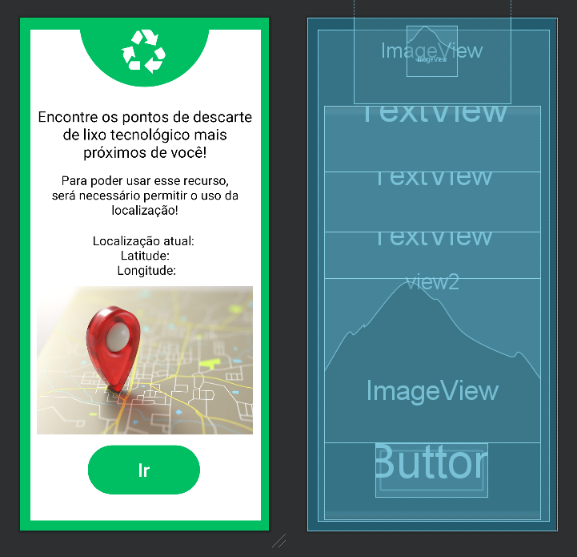

# TechTrash_2.0
## Aplicativo criado por Matheus Militão da Silva e Matheus Gama Russi   2 DS   
## Trabalho de PAM - Profa Aline   

### Tópicos  
- Intuito do projeto.
- Processo de criação.  

### Intuito do projeto  
O projeto TecTrash foi criado com o intuito de poder conscientizar e auxiliar o usuário em relação ao lixo eletrônico, que se descartado de maneira incorreta, acaba sendo extremamente prejudicial ao meio ambiente, podendo reduzir a vida de aterros sanitários, contaminar os solos, fauna e flora, por conta da quantidade de metais pesados.   
Sabendo-se disso, juntamente com a conscientização, viriam telas que ensinasse a maneira correta do descarte desse tipo de lixo, seja em pontos de coleta, ou até mesmo entrando em contato com o fabricante. 

<br>

### Processo de criação  
O aplicativo conta com 6 telas, com 1 delas sendo a de inicio, 1 sendo para a escolha do usuário(para decidir em qual sessão ele irá), e as outras 4 sendo sobre o conteúdo proposto.  
Foi utilizado a linguagem Java, e os recursos do Android Studio, como TextViews, Buttons(e ImageButtons), transição de uma tela para a outra, entre outros.  
Em relação ao design, preferimos utilizar as cores branco e verde, para ppoder simbolizar de maneira mais fiel sobre a importância do bem estar da natureza, e simbolos como o de reciclagem, que foi um dos mais utilizados no aplicativo.  


### Ao total foram:
- 5 Buttons
- 4 ImageButtons
- Diversas TextViews
- Simbolos e Imagens
- 6 Telas
- Entre outros.
<br>

## Diagrama de classes - TechTrash


### Classe Lixos
```
É a classe principal (até o momento) do aplicativo. Todas as outras classes dependeriam dela, pois toda as informações "sairiam" de lá.
```

### classe Curiosidades
```
É uma classe que recebrá uma nova tela que conterá curiosidades sobre o lixo eletrônico 
```

### Classe pontos de descarte
```
Entraria como uma informação que não ficaria diretamente dentro da classe Lixo, mas sim dentro de um dos atributos da classe Lixo
```

<br>

# Itens que foram adcionados no aplicativo

### Tela de "login"
``` 
Na tela inicial do app foi adcionada uma EditText que receberá o nome do usuário, assim agindo como uma forma de "cadastro".
```

### Localização, Email e telefone
```
Todos os itens citados acima foram adcionados em uma única tela, de forma que trabalhariam em conjuto (Localização: saber o local exato; Email: perguntando sobre informações; Telefone: ligar para agendar uma retirad de lixo)
```

  Durante o desenvolvimento do app, o principal foco foi o aprendizado. Fui seguindo todas as recomendações passadas em aula, assim tendo uma experiência e aprendizado maior sobre  alinguagem Java e o AndroidStudio. Seguindo as boas práticas da programação, fui capaz de fazer um app informativo, usufruindo de diversos códigos e elementos. <br> 
O foco principal do app TechTrash é informatizar a todos sobre o básico sobre o lixo eletrônico, algo que está em abundante crescimento nos tempos atuais. No app podemos ver informações do tipo: 
- O que é o lixo eletrônico?
- Onde impactam?
- Como impactam?
- Como descartar e reutilizar?
- Localização?
- Curiosidades?
<br>
  O lixo eletrônico é uma preocupação ambiental e de saúde pública devido aos materiais tóxicos e poluentes presentes em muitos dispositivos, como mercúrio, chumbo e produtos químicos perigosos. Quando inadequadamente descartado, pode contaminar o solo, a água e o ar, causando danos ao meio ambiente e à saúde humana.
<br>
<br>
  A reciclagem e a gestão adequada do lixo eletrônico são essenciais para reduzir seus impactos negativos. Isso envolve a coleta, desmontagem, recuperação de materiais valiosos e o descarte seguro dos resíduos. Além disso, a reutilização e a doação de dispositivos eletrônicos ainda funcionais podem ajudar a prolongar sua vida útil e reduzir a produção de lixo eletrônico. Portanto, o tratamento responsável do lixo eletrônico é crucial para proteger o meio ambiente e promover a sustentabilidade.

# Pontos de Reciclagem
  Durante o 4º bimestre, foi implementado uma nova função ao app, sendo ela a de te indicar os pontos de coleta de reciclagem mais proximos de você a partir do seu GPS, abrindo o seu
  aplicativo preferido de mapas, tais como o Google Maps.
  
  Para a realização desta funcionalidade, foi preciso utilizar do sensor de 
  localização que o Android disponibiliza para os desenvolvedores. Acompanhe abaixo o passo a passo.

## Passo a Passo
### Permissões
  Antes de se pensar em colocar o sensor, é preciso que o aplicativo tenha a
  devida permissão para utilizar o mesmo. Para isso, no AndroidManifest.xml, há 3 linhas que permitem o acesso.
  ```
  <uses-permission android:name="android.permission.ACCESS_COARSE_LOCATION"/>
  <uses-permission android:name="android.permission.ACCESS_FINE_LOCATION" />
  <uses-permission android:name="android.permission.INTERNET"/>
  ```
  O primeiro, simplesmente permite o acesso à localização via GPS, que retornará os valores de latitude e longitude do dispositivo. O segundo, permite uma checagem à localização de uma maneira mais precisa O terceiro permite o acesso a internet, para que possa efetuar pesquisas, que é fundamental para esta nova funcionalidade.

### Criação da Tela
  Com as permissões necessárias, a criação da tela é viável. Criamos uma classe PontosActivity.java junto de uma pontos_activity.xml para tal necessidade, ela se paresse como isso:
  

### Codificação
  Indo para dentro do código, por partes, temos primeiro o seguinte:
  ```
    package com.example.techtrash;

    import androidx.appcompat.app.AlertDialog;
    import androidx.appcompat.app.AppCompatActivity;
    import androidx.core.app.ActivityCompat;

    import android.Manifest;
    import android.content.Context;
    import android.content.DialogInterface;
    import android.content.Intent;
    import android.content.pm.PackageManager;
    import android.location.Location;
    import android.location.LocationManager;
    import android.net.Uri;
    import android.os.Bundle;
    import android.provider.Settings;
    import android.view.View;
    import android.widget.Button;
    import android.widget.TextView;
    import android.widget.Toast;

    public class PontoReciclagemActivity extends AppCompatActivity {

        private static final int REQUEST_LOCATION = 1;
        Button btn;
        TextView location;
        LocationManager lm;
        String lat,lon;

        @Override
        protected void onCreate(Bundle savedInstanceState) {
            super.onCreate(savedInstanceState);
            setContentView(R.layout.activity_ponto_reciclagem);

            ActivityCompat.requestPermissions(this, new String[]{
                    Manifest.permission.ACCESS_FINE_LOCATION}, REQUEST_LOCATION);

            location = findViewById(R.id.txtLocation);
        }

  ```

  Importamos todas as classes necessárias para o restante do código, declaramos algumas variáveis. "REQUEST_LOCATION" é responsável por dizer se o sensor de localização foi aprovada, 1 (seu valor) é positivo. "btn" e "location" são Views da tela, "lm" é uma instancia da classe LocationManager, detentora de funções que usaremos mais tarde, e por fim, "lat" e "lon" para receber o valor de latitude e longitude.

  Na função onCreate, pedimos a localização, e preencho a variavel "location" com a View da tela a partir de sua ID.

  <hr>
  <br>

  ```
    public void pegarLocalização(View v){
        lm = (LocationManager) getSystemService(Context.LOCATION_SERVICE);
        if(!lm.isProviderEnabled(LocationManager.GPS_PROVIDER)) {
            OnGPS();
        }else{
            getLocation();
            Uri actualLocation = Uri.parse("geo:" + lat + ", " + lon + "?q=Ponto+de+reciclagem+mais+próximo");
            Intent maps = new Intent(Intent.ACTION_VIEW, actualLocation);
            startActivity(maps);
        }
    }
  ```

  A função acima é aquela que está no atributo "OnClick" do botão da tela. Primeiramente ela preenche a variavel "lm" com o sensor de localização, e logo depois, faz uma condicional, se o provedor de GPS não está ligado, ele irá rodar a função OnGPS(); que falaremos mais tarde, caso contrário, ele vai rodar a função getLocation();, falaremos mais tarde também, mas além disso, ele também cria uma Intent redirecionando para um app de mapa, com as variaveis "lat" e "lon" nos campos de latitude e longitude, bem como uma pesquisa de "Ponto de reciclagem mais próximo".

  <hr>
  <br>

   ```
    private void OnGPS() {
        final AlertDialog.Builder builder = new AlertDialog.Builder(this);
        builder.setMessage("Ative o GPS").setCancelable(false).setPositiveButton("YES", new DialogInterface.OnClickListener() {
            @Override
            public void onClick(DialogInterface dialogInterface, int i) {
                startActivity(new Intent(Settings.ACTION_LOCATION_SOURCE_SETTINGS));
            }
        }).setNegativeButton("NO", new DialogInterface.OnClickListener() {
            @Override
            public void onClick(DialogInterface dialogInterface, int i) {
                dialogInterface.cancel();
            }
        });
        final AlertDialog ad = builder.create();
        ad.show();
    }
  ```

  Aqui temos a função OnGPS(); apresentada mais cedo. Basicamente caso o usuário clique no botão de procurar pelos pontos de reciclagem próximos, com a permissão de localização desativa, o app cria um AlertDialog, mostrando uma mensagem de "Ative o GPS", com um botão que redireciona para as configurações do app, indicando que o usuário ative a localização de maneira manual.

  <hr>
  <br>

  ```
    private void getLocation() {
        if(ActivityCompat.checkSelfPermission(PontoReciclagemActivity.this, Manifest.permission.ACCESS_FINE_LOCATION) != PackageManager.PERMISSION_GRANTED && ActivityCompat.checkSelfPermission(PontoReciclagemActivity.this, Manifest.permission.ACCESS_COARSE_LOCATION) != PackageManager.PERMISSION_GRANTED){
            ActivityCompat.requestPermissions(this, new String[]{
                    Manifest.permission.ACCESS_FINE_LOCATION}, REQUEST_LOCATION);
        }else{
            Location locationGPS = lm.getLastKnownLocation(LocationManager.GPS_PROVIDER);
            Location locationNetwork = lm.getLastKnownLocation(LocationManager.NETWORK_PROVIDER);
            Location locationPassive = lm.getLastKnownLocation(LocationManager.PASSIVE_PROVIDER);

            if(locationGPS != null){
                double latitude = locationGPS.getLatitude();
                double longitude = locationGPS.getLongitude();

                lat = String.valueOf(latitude);
                lon = String.valueOf(longitude);

                location.setText("Localização atual:" + "\n" + "Latitude: " + lat + "\n" + "Longitude: " + lon);
            }else if(locationNetwork != null){
                double latitude = locationNetwork.getLatitude();
                double longitude = locationNetwork.getLongitude();

                lat = String.valueOf(latitude);
                lon = String.valueOf(longitude);

                location.setText("Localização atual:" + "\n" + "Latitude: " + lat + "\n" + "Longitude: " + lon);
            }else if(locationPassive != null){
                double latitude = locationPassive.getLatitude();
                double longitude = locationPassive.getLongitude();

                lat = String.valueOf(latitude);
                lon = String.valueOf(longitude);

                location.setText("Localização atual:" + "\n" + "Latitude: " + lat + "\n" + "Longitude: " + lon);
            }else{
                Toast.makeText(this, "Não foi possível pegar a sua localização", Toast.LENGTH_SHORT).show();
            }
        }
    }
  ```
  E por fim, aqui temos a função getLocation();, apresentada junto do OnGPS();. Mais uma vez ele checará se a permissão esta desativada. se estiver, ele pedirá, mas se já estiver ativa, ele vai pegar a latitude e longitude do dispositivo. 

  Para isso, ele cria 3 variáveis da classe Location, que receberão as ultimas informações da localização, para caso ele esteje sem conexão com a internet. Após, ele checa cada uma das variáveis, vendo se elas não estão vazias, caso elas já estejem preenchidas, ele pega a latitude e longitude, e apresenta na TextView da tela, caso nenhuma das 3 variáveis estiverem vazias, ele apresenta uma mensagem toast, dizendo que não foi possível pegar a localização.

  <hr>
  <br>

# Vídeo do app atualizado: 
https://youtu.be/MUV2bZbBZoY?si=FSf83kAHK-dBbyRw